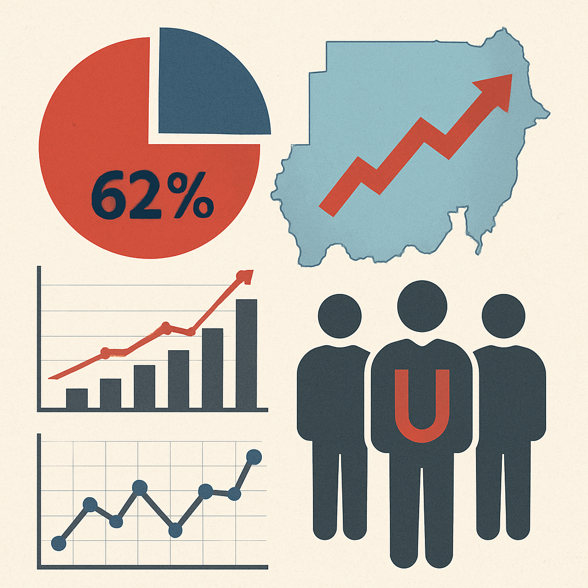

<!DOCTYPE html>
<html lang="ar" dir="rtl">
<head>
    <meta charset="UTF-8">
    <meta name="viewport" content="width=device-width, initial-scale=1.0">
    <title>محمد محجوب إسماعيل | طالب علوم رياضية وحاسوب</title>
    <link href="https://fonts.googleapis.com/css2?family=Cairo:wght@300;400;600;700&display=swap" rel="stylesheet">
    <link rel="stylesheet" href="https://cdnjs.cloudflare.com/ajax/libs/font-awesome/6.4.0/css/all.min.css">
    
</head>
<body>
    

    
    

        

        

        

    

    
    <header>
        

            <nav>
                

                    <i class="fas fa-user"></i>
                    محمد محجوب إسماعيل
                

                <ul class="nav-links">
                    <li><a href="#" class="nav-link active" data-page="home">الرئيسية</a></li>
                    <li><a href="#" class="nav-link" data-page="cv">السيرة الذاتية</a></li>
                    <li><a href="#" class="nav-link" data-page="portfolio">أعمالي</a></li>
                    <li><a href="#" class="nav-link" data-page="contact">اتصل بنا</a></li>
                </ul>
                <button class="theme-toggle" id="themeToggle">
                    <i class="fas fa-moon"></i>
                </button>
            </nav>
        

    </header>
    
    <main>
        <section id="home" class="page active">
            

                

                    

                        
                    

                    
مرحباً!

                    <h1>أنا محمد محجوب إسماعيل</h1>
                    
طالب جامعي بكلية العلوم الرياضية والحاسوب بجامعة الجزيرة، أسعى لتطوير نفسي باستمرار وتعلم كل ما يمكن تعلمه في مجال الرياضيات والحوسبة.

                    

                        <a href="#" class="btn" data-page="portfolio">مشاريعي</a>
                        <a href="#" class="btn btn-outline" data-page="contact">تواصل معي</a>
                    

                

            

        </section>
        
        <section id="cv" class="page">
            

                

                    <h2>السيرة الذاتية</h2>
                    
تعرف على مهاراتي وخبراتي

                

                
                

                    

                        

                            <h3>معلومات شخصية</h3>
                            

                                
<strong>الاسم:</strong> محمد محجوب إسماعيل

                                
<strong>العمر:</strong> 25 سنة

                                
<strong>البلد:</strong> السودان

                                
<strong>اللغات:</strong> العربية (متقن)، الإنجليزية (متوسط)

                            

                        

                        
                        

                            <h3>المهارات</h3>
                            

                                HTML/CSS
                                MySQL
                                التحليل الإحصائي
                                الرياضيات التطبيقية
                                تحليل البيانات
                                حل المشكلات
                                البحث العلمي
                            

                        

                        
                        

                            <h3>التواصل</h3>
                            

                                
<i class="fas fa-envelope"></i> mhjwmhmd.com

                                
<i class="fas fa-phone"></i> 0964916347

                                
<i class="fas fa-map-marker-alt"></i> السودان

                            

                        

                    

                    
                    

                        

                            <h3>نبذة عني</h3>
                            
أنا طالب جامعي في كلية العلوم الرياضية والحاسوب بجامعة الجزيرة، أسعى دائماً لتطوير نفسي ومهاراتي في مجالات الرياضيات التطبيقية وعلوم الحاسوب. أحب التعلم المستمر وأبحث دائماً عن فرص جديدة للتطور المهني والشخصي.

                        

                        
                        

                            <h3>التعليم</h3>
                            

                                <h4>بكالوريوس العلوم الرياضية والحاسوب</h4>
                                
جامعة الجزيرة، السودان

                                
طالب في السنة النهائية، متخصص في الرياضيات التطبيقية وعلوم الحاسوب.

                            

                        

                        
                        

                            <h3>المشاريع الأكاديمية</h3>
                            

                                <h4>نظام مراقبة المحال التجارية</h4>
                                
تطوير نظام متكامل لمراقبة وإدارة المحال التجارية مع واجهة مستخدم سهلة الاستخدام وقاعدة بيانات فعالة.

                            

                            
                            

                                <h4>تطوير عمل بنك البركة</h4>
                                
مشروع يهدف إلى تحسين وتطوير العمليات المصرفية باستخدام حلول تقنية مبتكرة.

                            

                            
                            

                                <h4>تحليل إحصائي للبطالة في السودان</h4>
                                
دراسة إحصائية شاملة لمشكلة البطالة في السودان، مع تحليل الأسباب واقتراح حلول.

                            

                        

                        
                        

                            <h3>الأهداف المهنية</h3>
                            

                                
تطوير مهاراتي في مجال علوم البيانات والتحليل الإحصائي

                                
اكتساب خبرة عملية في مجال تطوير البرمجيات

                                
المساهمة في حل المشكلات المجتمعية من خلال التكنولوجيا

                                
مواصلة التعليم العالي في مجال الرياضيات التطبيقية

                            

                        

                    

                

            

        </section>
        
        <section id="portfolio" class="page">
            

                

                    <h2>أعمالي ومشاريعي</h2>
                    
أهم المشاريع التي قمت بتنفيذها

                

                
                

                    

                        

                            
                        

                        

                            <h3>نظام مراقبة المحال التجارية</h3>
                            
نظام متكامل لإدارة ومراقبة المحال التجارية يتضمن إدارة المخزون والمبيعات والموظفين.

                            

                                HTML/CSS
                                MySQL
                                نظم الإدارة
                            

                        

                    

                    
                    

                        

                            
                        

                        

                            <h3>تطوير عمل بنك البركة</h3>
                            
مشروع يهدف إلى تحسين العمليات المصرفية وتطوير أنظمة العمل في بنك البركة باستخدام حلول تقنية متقدمة.

                            

                                تحليل النظم
                                تطوير العمليات
                                حلول مصرفية
                            

                        

                    

                    
                    

                        

                            
                        

                        

                            <h3>تحليل إحصائي للبطالة في السودان</h3>
                            
دراسة إحصائية شاملة لمشكلة البطالة في السودان تشمل تحليل البيانات، تحديد الأسباب، واقتراح حلول عملية.

                            

                                التحليل الإحصائي
                                علوم البيانات
                                البحث العلمي
                            

                        

                    

                

            

        </section>
        
        <section id="contact" class="page">
            

                

                    <h2>اتصل بنا</h2>
                    
نحن هنا للإجابة على استفساراتك

                

                
                

                    

                        <form id="contactForm">
                            

                                <label for="name">الاسم الكامل</label>
                                <input type="text" id="name" class="form-control" required>
                                
يرجى إدخال اسم صحيح

                            

                            
                            

                                <label for="email">البريد الإلكتروني</label>
                                <input type="email" id="email" class="form-control" required>
                                
يرجى إدخال بريد إلكتروني صحيح

                            

                            
                            

                                <label for="inquiry">نوع الاستفسار</label>
                                <select id="inquiry" class="form-control" required>
                                    <option value="" disabled selected>اختر نوع الاستفسار</option>
                                    <option value="تعليق">تعليق</option>
                                    <option value="مقترح">مقترح</option>
                                    <option value="شكوى">شكوى</option>
                                    <option value="استفسار">استفسار</option>
                                    <option value="أخرى">أخرى</option>
                                </select>
                                
يرجى اختيار نوع الاستفسار

                            

                            
                            

                                <label for="message">رسالتك</label>
                                <textarea id="message" class="form-control" required></textarea>
                                
يرجى كتابة رسالتك

                            

                            
                            <button type="submit" class="btn" style="width: 100%;">
                                <i class="fas fa-paper-plane"></i> إرسال الرسالة
                            </button>
                        </form>
                    

                    
                    

                        <h3>معلومات التواصل</h3>
                        
                        

                            <i class="fas fa-map-marker-alt"></i>
                            

                                <h4>العنوان</h4>
                                
جامعة الجزيرة، السودان

                            

                        

                        
                        

                            <i class="fas fa-phone"></i>
                            

                                <h4>الهاتف</h4>
                                
0964916347

                            

                        

                        
                        

                            <i class="fas fa-envelope"></i>
                            

                                <h4>البريد الإلكتروني</h4>
                                
mhjwmhmd.com

                            

                        

                        
                        

                            <i class="fas fa-clock"></i>
                            

                                <h4>ساعات التواصل</h4>
                                
الأحد - الخميس: 9 صباحاً - 5 مساءاً

                                
الجمعة والسبت: متاح في الصباح

                            

                        

                        
                        

                            <i class="fas fa-graduation-cap"></i>
                            

                                <h4>الدراسة</h4>
                                
طالب في كلية العلوم الرياضية والحاسوب

                                
جامعة الجزيرة

                            

                        

                    

                    
                    

                        <h3>آخر التعليقات</h3>
                        

                            

                                

                                    أحمد حسن
                                    مقترح
                                

                                
ahmed@example.com

                                
أعجبني مشروع التحليل الإحصائي للبطالة، هل يمكن مشاركة الدراسة كاملة؟

                            

                            

                                

                                    سارة محمد
                                    استفسار
                                

                                
sara@example.com

                                
هل تبحث عن فرص تدريب في مجال تحليل البيانات؟ لدينا فرصة قد تناسبك.

                            

                        

                    

                

            

        </section>
    
</body>
</html>
<!DOCTYPE html>
<html lang="ar" dir="rtl">
<head>
    <!-- باقي كود head كما هو -->
</head>
<body>
    <!-- باقي كود الموقع كما هو -->

    <footer>
        

            

                <i class="fas fa-user"></i>
                محمد محجوب إسماعيل
            

            
            

                <a href="#"><i class="fab fa-facebook-f"></i></a>
                <a href="#"><i class="fab fa-twitter"></i></a>
                <a href="#"><i class="fab fa-linkedin-in"></i></a>
                <a href="#"><i class="fab fa-github"></i></a>
                <a href="#"><i class="fab fa-researchgate"></i></a>
            

            
            
طالب في كلية العلوم الرياضية والحاسوب بجامعة الجزيرة &copy; 2025

        

    </footer>

    
</body>
</html>
